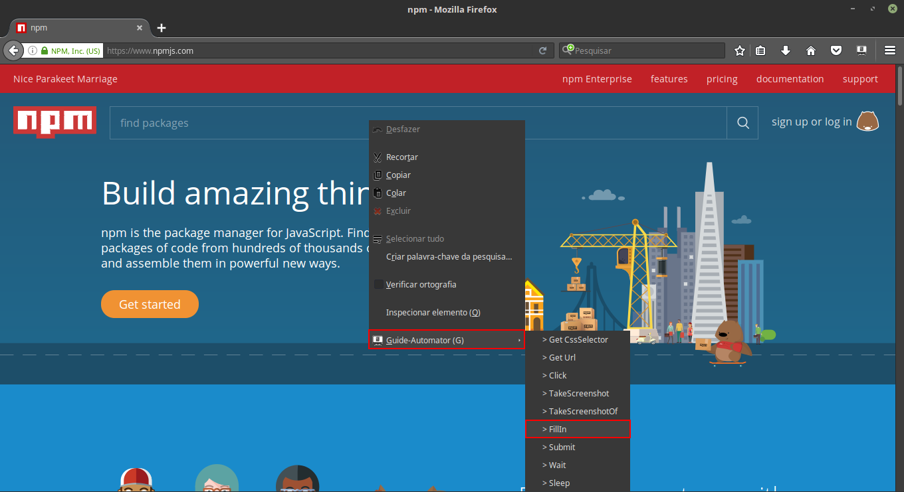
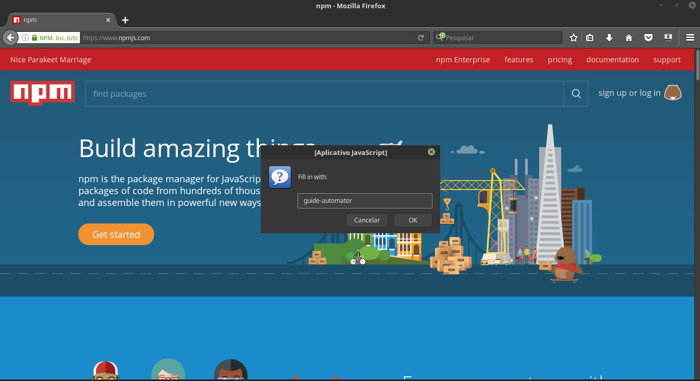
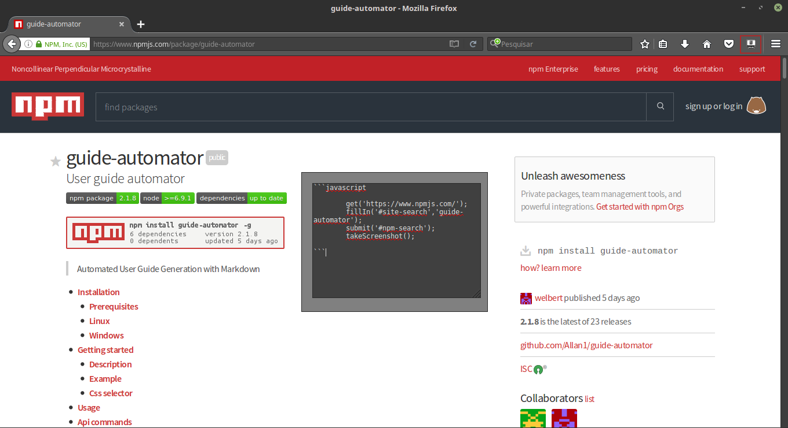

# Guide-Automator Firefox Add-on

Help to build [guide-automator](https://www.npmjs.com/package/guide-automator) blocks

Extension created using [jpm](https://www.npmjs.com/package/jpm)

# Usage

Right-click an element on a web page, select menu "Guide-Automator", select any option and it will be copied to your clipboard with npm guide-automator's format.

You can view all generated codes by clicking the button on the tool bar extension.

