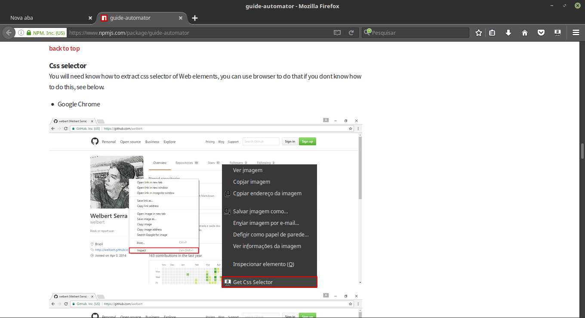

# Guide-Automator Firefox Add-on

Help to build [guide-automator](https://www.npmjs.com/package/guide-automator) blocks

Extension created using [jpm](https://www.npmjs.com/package/jpm)

# Usage

Right-click an element on a web page, select "Get Css Selector" and it will be copied to your clipboard

